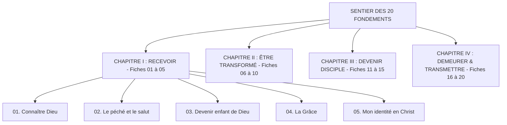

# 📘 Documentation Complète — Plateforme « Les Fondements »

---

## 🌟 1. Vision Spirituelle & Pédagogique

La plateforme **« Les Fondements »** est une application web et mobile progressive conçue pour transformer le livret de formation de disciples de 164 pages (*moneglisepreferee.net*) en une expérience vivante, interactive et immersive.

### Objectifs Clés :
1. **Enracinement personnel** : Permettre à chaque croyant de s'approprier les fondements de la foi chrétienne à son propre rythme (1 étape par semaine sur ~5 mois).
2. **Communion fraternelle** : Favoriser la dynamique de petits groupes de maison (cellules de 5 à 6 personnes) avec partage authentique, requêtes de prière et flux de pépites.
3. **Mise en mouvement** : Transformer la connaissance théologique en mise en pratique concrète et en transmission à d'autres disciples.

---

## 🏗️ 2. Architecture Technique & Choix Technologiques

| Composant | Technologie | Justification |
|---|---|---|
| **Framework Web** | **Next.js 16 (App Router + Turbopack)** | Performances maximales, rendu hybride serveur/client, routage moderne et génération statique optimisée. |
| **Design System** | **Tailwind CSS v4** | Palette éditoriale noble (Bleu Nuit `#07162b`, Or/Safran `#f6c453`, Parchemin `#f8f3e9`), animations fluides. |
| **Iconographie** | **Système `ModernIcon` & Lucide Icons** | Badges *squircles* duotone haute définition (style Apple/Linear), traits affinés (`strokeWidth=1.75`), symboles sobres et bibliques. |
| **Authentification & Données** | **Système Hybride (Firebase Spark + Local Storage)** | Fonctionne immédiatement sans aucune clé requise (Mode Invité 1-clic avec persistance locale) tout en permettant la synchronisation Cloud multi-appareils gratuite dès que les clés Firebase sont ajoutées. |
| **Accessibilité & Audio** | **Web Speech API (TTS)** | Synthèse vocale française native avec vitesse ajustable (1x, 1.25x, 1.5x) intégrée sans coût d'API. |
| **Partage Réseaux Sociaux** | **Canvas SVG to PNG Engine** | Générateur haute définition d'images de versets au format Story Instagram / WhatsApp (1080x1350) avec 5 thèmes de couleurs. |
| **Mobile & PWA** | **Manifest Web App & PWA Prompt** | Installation sur smartphone en 1 clic (iOS Safari & Android Chrome) avec icônes et fonctionnement autonome. |

---

## 🗺️ 3. Le Sentier des 20 Fondements (Feuille de Route)

Le parcours est structuré en **4 grands chapitres architecturaux** de 5 étapes chacun :



### Le Rythme Hebdomadaire en 3 Temps :
1. **Je prépare** *(personnellement)* : Lecture, écoute de la narration, méditation du verset ancre et réponses aux questions de réflexion.
2. **Nous partageons** *(en cellule de 5-6)* : Réunion hebdomadaire (présentielle ou visio), échange sur les réponses, prière commune et partage de pépites.
3. **Je pratique** *(dans la vie quotidienne)* : Un pas concret de foi, de réconciliation, de service ou de proclamation du Royaume.

---

## 🕊️ 4. Le Mode Immersion Guidée (Sanctuaire)

Disponible sur chaque fiche via le bouton doré **« 🎧 Mode Immersion Guidée »**, cette expérience plein écran sans distraction conduit le disciple à travers **5 étapes spirituelles** :

1. **🌿 Disposition du cœur & Silence** : Respiration, recentrage et prière d'introduction.
2. **📖 Écoute & Révélation de l'Enseignement** : Narration vocale paragraphe par paragraphe avec versets clés mis en valeur.
3. **💎 Méditation du Verset Ancre** : Répétition et ancrage du verset dans la mémoire.
4. **✍️ Questions de Cœur** : Réflexion personnelle guidée, une question à la fois, avec sauvegarde automatique.
5. **🤝 Défi & Bénédiction** : Action concrète pour la semaine, validation et déblocage de l'étape suivante.

---

## 📱 5. Inventaire des Modules & Pages

| Route | Rôle & Fonctionnalités |
|---|---|
| **`/`** | **Page d'Accueil Éditoriale** : Hero avec scène aérienne du groupe, présentation des 3 rythmes, prévisualisation du sentier, certificat et accès libre. |
| **`/dashboard`** | **Tableau de Bord Disciple** : Progression globale (X/20), Heatmap de fidélité spirituelle sur 365 jours, verset du jour, journal récent et lanceur d'immersion. |
| **`/fiches`** | **Le Sentier des 20 Fiches** : Vue Winding Roadmap avec ruban doré et jalons numérotés, bascule en vue Grille compacte, recherche instantanée par thème. |
| **`/fiches/[id]`** | **Fiche d'Étude Interactive** : 4 onglets (*Enseignement*, *Résumé & Partage*, *Questions*, *Quiz de révision*), Lecteur audio TTS, Lecteur Vidéo (YouTube/MP4), validation. |
| **`/groupes`** | **Cellule & Vie de Groupe** : Gestion de groupe (5-6 membres), lien Visio direct, guide minuteur de l'animateur, Mur de Prière interactif, onglet **« 💎 Pépites & Trésors »**. |
| **`/memorisation`** | **Mémorisation Biblique** : Cartes Flashcards 3D avec système de répétition espacée (*À revoir / Maîtrisé*), lecture audio et export d'images de versets. |
| **`/journal`** | **Journal Spirituel** : Carnet intime pour consigner révélations, prières et réflexions personnelles avec tri par date. |
| **`/index-thematique`** | **Index Thématique Exhaustif** : Reproduction numérique interactive de la page 163 du livret avec moteur de recherche et tags. |
| **`/ressources`** | **Bibliographie & Ouvrages** : Reproduction numérique de la page 164 du livret (Derek Prince, Watchman Nee, Neil Anderson...) avec liens de recherche. |
| **`/certificat`** | **Certificat de Fin de Parcours** : Attestation officielle personnalisée avec le verset de Colossiens 1:28, date de complétion et bouton d'impression/PDF. |
| **`/temoignages`** | **Mur de Témoignages** : Partage public des victoires et des transformations vécues au cours du parcours. |
| **`/login`** | **Accès Disciple** : Bouton d'accès immédiat 1-clic (Mode Invité local) ou connexion sécurisée par Email / Google. |

---

## 👥 6. Guide de l'Animateur de Cellule

### Recommandations du Livret (Page 3) :
- **Effectif idéal** : 5 à 6 participants pour garantir la prise de parole de chacun.
- **Durée conseillée** : 1h30 à 2h00 par rencontre.
- **Rôle de l'animateur** : Faciliter les échanges, veiller à l'écoute mutuelle, encourager la confidentialité et respecter le minuteur.

### Structure Type d'une Rencontre :
```
1. Accueil & Louange / Prière d'ouverture (15 min)
2. Partage des réponses à la fiche de la semaine (45 min)
3. Découverte des Pépites & Verset à mémoriser (15 min)
4. Intercession sur le Mur de Prière & Bénédiction (15 min)
```

---

## ⚙️ 7. Configuration & Déploiement

### 1. Variables d'Environnement (`.env.local`) :
```env
# Configuration Firebase (Optionnelle pour la synchronisation Cloud multi-appareils)
NEXT_PUBLIC_FIREBASE_API_KEY=votre-cle-api
NEXT_PUBLIC_FIREBASE_AUTH_DOMAIN=votre-projet.firebaseapp.com
NEXT_PUBLIC_FIREBASE_PROJECT_ID=votre-projet-id
NEXT_PUBLIC_FIREBASE_STORAGE_BUCKET=votre-projet.appspot.com
NEXT_PUBLIC_FIREBASE_MESSAGING_SENDER_ID=votre-sender-id
NEXT_PUBLIC_FIREBASE_APP_ID=votre-app-id
```

> [!NOTE]
> Si les clés Firebase ne sont pas renseignées, l'application active automatiquement le **mode de persistance locale (`localStorage`)**. Aucune étape n'est bloquante pour l'utilisateur.

### 2. Commandes Utiles :
```bash
# Installer les dépendances
npm install

# Lancer le serveur de développement
npm run dev

# Tester la compilation de production
npm run build

# Démarrer en production
npm start
```

---

## 📖 8. Maintenance & Enrichissement des Données

- **Les 20 fiches** : extraites du PDF d'origine puis versionnées dans `src/data/livret.json` (chargé à la demande). Voir les scripts `scripts/parse-livret.py` et `scripts/build-livret-data.py`.
- **Métadonnées du sentier** : `src/data/fichesMeta.ts` (titres, sous-titres, icônes, pages) — généré, ne pas modifier à la main.
- **Versets connus (Louis Segond 1910)** : `src/data/versets.ts` est la source de référence du texte biblique déjà présent dans l'application.

> [!NOTE]
> Pour enrichir le contenu, modifiez la source (`livret.json` via les scripts d'import) puis régénérez `fichesMeta.ts` et les voix. Les anciens fichiers `fiches.ts` / `allFiches.ts` ont été remplacés par cette chaîne d'import.
