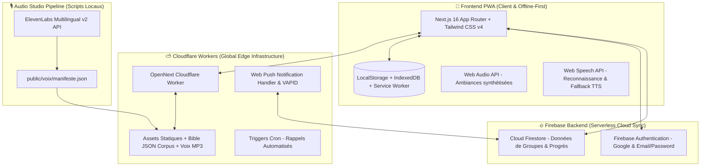

# 📘 Documentation Complète — Plateforme « Les Fondements »

---

## 🌟 1. Vision Spirituelle & Pédagogique

La plateforme **« Les Fondements »** est une application web et mobile progressive (PWA) de formation de disciples, conçue pour transformer le livret de référence de 164 pages (*moneglisepreferee.net*, 2015) en une expérience vivante, tactile, interactive et immersive.

### Les 3 Principes Fondateurs :
1. **Une table de travail vivante** : L'interface abandonne la froideur des applications utilitaires classiques pour recréer l'intimité chaleureuse d'une véritable table d'étude en bois noble, agrémentée de parchemins authentiques, de notes manuscrites, de Post-its colorés, de punaises 3D, de trombones métalliques, de rubans washi tape et de sceaux officiels.
2. **Pas de groupe, pas de parcours** : Conformément à la méthodologie du livret (*« 5 à 6 participants est un bon équilibre »*), les fiches ne se parcourent pas en solitaire. Chaque membre étudie sa fiche chez soi dans le calme, puis la cellule de disciples se réunit chaque semaine (sur place ou en visio) pour partager leurs découvertes, prier les uns pour les autres, et débloquer ensemble l'étape suivante.
3. **Une Bible vivante, intégrée et immédiate** : Chaque référence scripturaire (*ex. Jean 3:16, Romains 8:31-32, Apocalypse 1:8*) est instantanément cliquable pour faire éclore une bulle de lecture en Louis Segond 1910 sans jamais quitter son texte, avec accès direct aux termes originaux hébreux et grecs (lexique Strong), aux renvois croisés et à l'écoute audio.

---

## 🏗️ 2. Architecture Technique & Choix Technologiques



| Composant | Technologie | Rôle & Justification |
|---|---|---|
| **Framework Web** | **Next.js 16 (App Router + Turbopack)** | Rendu hybride ultra-rapide, compilation instantanée et optimisation poussée des routes statiques et dynamiques. |
| **Hébergement & Edge** | **Cloudflare Workers (`@opennextjs/cloudflare`)** | Déploiement mondial serverless sans serveur physique, latence globale < 30ms, coût d'infrastructure de **0,00 €**. |
| **Design System & Papier** | **Tailwind CSS v4 + Caveat + Georgia** | Conception visuelle tactile : textures de bois (`.table-travail`), parchemins (`.feuille`), Post-its (`.postit-rose`, `.postit-vert`), punaises 3D, sceaux transparents et calligraphie manuscrite (`.manuscrit`). |
| **Base de Données & Auth** | **Firebase Spark (Firestore + Auth)** | Mode hybride : fonctionnement 100 % hors-ligne immédiat (LocalStorage) et synchronisation Cloud temps réel gratuite avec règles de sécurité strictes. |
| **Corpus Biblique Statique** | **Static JSON Corpus (35 Mo, 317 fichiers)** | Louis Segond 1910 complet, 14 627 numéros Strong (hébreu/grec), Treasury of Scripture Knowledge (29 169 renvois), Bible Nave (5 313 thèmes), Matthew Henry (1 188 chapitres). |
| **Moteur Audio Dual-Engine** | **ElevenLabs Studio MP3 + Web Speech + Web Audio** | Voix narratives studio pré-générées dans `public/voix/eleven/`, lecture continue avec enchaînement automatique, ambiances méditatives synthétisées par Web Audio API, et fallback Web Speech API. |
| **Reconnaissance Vocale** | **Web Speech Recognition API** | Analyse locale de la voix en direct pour la mémorisation mot à mot : 100% privé, aucun flux audio transmis vers un serveur externe. |
| **Notifications & Push** | **Web Push Protocol + Cloudflare Crons** | Alertes et rappels réguliers calqués sur le rythme hebdomadaire de la cellule, gestion des clés VAPID et triggers cron programmés. |

---

## 🗺️ 3. Le Sentier des 20 Fondements

```mermaid
graph TD
    A[LE SENTIER DES 20 FONDEMENTS] --> C1[CHAPITRE I : RECEVOIR - Fiches 01 à 05]
    A --> C2[CHAPITRE II : ÊTRE TRANSFORMÉ - Fiches 06 à 10]
    A --> C3[CHAPITRE III : DEVENIR DISCIPLE - Fiches 11 à 15]
    A --> C4[CHAPITRE IV : DEMEURER & TRANSMETTRE - Fiches 16 à 20]

    C1 --> F1[01. Connaître Dieu]
    C1 --> F2[02. Le péché et le salut]
    C1 --> F3[03. Devenir enfant de Dieu]
    C1 --> F4[04. La Grâce]
    C1 --> F5[05. Mon identité en Christ]

    C2 --> F6[06. Un comportement nouveau]
    C2 --> F7[07. Vivre libre - 1ère partie]
    C2 --> F8[08. Vivre libre - 2ème partie]
    C2 --> F9[09. Le Saint-Esprit : sa demeure en nous]
    C2 --> F10[10. Le Saint-Esprit : un revêtement de puissance]

    C3 --> F11[11. Le Saint-Esprit : ministère, dons et fruit]
    C3 --> F12[12. Disciple de Jésus - 1ère partie]
    C3 --> F13[13. Disciple de Jésus - 2ème partie]
    C3 --> F14[14. Le Royaume, l'Église et la mission]
    C3 --> F15[15. Une communauté relationnelle]

    C4 --> F16[16. La prière]
    C4 --> F17[17. La Bible]
    C4 --> F18[18. L'ancienne et la nouvelle Alliance]
    C4 --> F19[19. Israël et l'Église]
    C4 --> F20[20. Les fins dernières]
```



### Synthèse des 20 Fiches du Livret :

| N° | Titre de la Fiche | Thématique & Enseignement Central | Verset Clé à Mémoriser |
|:---:|---|---|---|
| **01** | **Connaître Dieu** | La souveraineté de Dieu, Son amour inconditionnel, la Trinité et Son cœur de Père. | *Apocalypse 1:8* / *1 Jean 4:16* |
| **02** | **Le péché et le salut** | La rupture originelle, l'incapacité de la Loi et l'œuvre rédemptrice de la Croix. | *Romains 3:23* / *Romains 6:23* |
| **03** | **Devenir enfant de Dieu** | La nouvelle naissance, la repentance, la foi vivante et le baptême d'eau. | *Jean 3:36* / *Romains 10:9-10* |
| **04** | **La Grâce** | Le don immérité, la puissance libératrice contre le légalisme et la vraie obéissance. | *Éphésiens 2:8-9* / *Jean 15:7* |
| **05** | **Mon identité en Christ** | L'échange divin à la Croix : rejeté pour que nous soyons acceptés, déclarés saints et justifiés. | *2 Corinthiens 5:21* / *Galates 2:20* |
| **06** | **Un comportement nouveau** | Le renouvellement de l'intelligence, la mort au vieil homme et la marche par l'Esprit. | *Romains 12:2* / *Éphésiens 4:22-24* |
| **07** | **Vivre libre (1ère partie)** | La victoire sur la culpabilité, le pardon accordé et reçu, et la guérison de l'âme. | *Romains 8:1* / *Colossiens 3:13* |
| **08** | **Vivre libre (2ème partie)** | Briser les liens, renoncer aux mensonges de l'ennemi et marcher dans l'autorité spirituelle. | *Jean 8:32* / *2 Corinthiens 10:4-5* |
| **09** | **Le Saint-Esprit : Sa demeure** | La personne de l'Esprit, le temple intérieur, le sceau et le témoignage intérieur. | *1 Corinthiens 6:19* / *Romains 8:16* |
| **10** | **Le Saint-Esprit : Revêtement** | Le baptême dans le Saint-Esprit, la puissance pour témoigner et la vie surnaturelle. | *Actes 1:8* / *Luc 11:13* |
| **11** | **Le Saint-Esprit : Dons & Fruit** | Les 9 dons spirituels pour l'édification et le fruit de l'Esprit pour le caractère. | *1 Corinthiens 12:7* / *Galates 5:22-23* |
| **12** | **Disciple de Jésus (1ère partie)** | Renoncer à soi-même, porter sa croix, l'amour premier et le coût de la marche. | *Luc 9:23* / *Jean 13:35* |
| **13** | **Disciple de Jésus (2ème partie)** | La gestion des pensées, du temps, des finances et le service dans l'humilité. | *Matthieu 6:33* / *Colossiens 3:17* |
| **14** | **Le Royaume, l'Église, la mission** | La proclamation de l'Évangile, faire des disciples de toutes les nations et le Corps du Christ. | *Matthieu 28:19-20* / *Matthieu 24:14* |
| **15** | **Une communauté relationnelle** | La vie d'Église authentique, la redevabilité, l'édification mutuelle et la communion fraternelle. | *Actes 2:42* / *Hébreux 10:24-25* |
| **16** | **La prière** | L'intimité dans le lieu secret, la prière d'intercession, le combat spirituel et le jeûne. | *Matthieu 6:6* / *1 Thessaloniciens 5:17* |
| **17** | **La Bible** | L'inspiration des Écritures, méditation quotidienne, autorité et puissance de la Parole. | *2 Timothée 3:16-17* / *Psaume 119:105* |
| **18** | **L'ancienne & nouvelle Alliance** | De l'ombre à la réalité : la supériorité du sacerdoce de Jésus et la loi gravée sur les cœurs. | *Hébreux 8:6* / *Jérémie 31:33* |
| **19** | **Israël et l'Église** | Le plan souverain de Dieu, l'olivier franc, le mystère d'Israël et l'unité des croyants. | *Romains 11:25-26* / *Éphésiens 2:14* |
| **20** | **Les fins dernières** | L'espérance du retour du Seigneur, la résurrection, le jugement et les nouveaux cieux. | *Tite 2:13* / *Apocalypse 21:3-4* |

---

## 🕊️ 4. Les Expériences & Innovations Spirituelles

### 🎙️ 1. Récitation à Voix Haute Interactive (Reconnaissance Vocale Locale)
- **Principe** : L'utilisateur récite le verset dans son microphone. Le texte biblique s'illumine mot à mot en vert au fur et à mesure de sa proclamation.
- **Confidentialité Totale** : Utilisation exclusive de la `Web Speech Recognition API` du navigateur. Aucun flux audio n'est envoyé vers un serveur tiers.
- **Score & Encouragement** : Calcul en temps réel de la fidélité de récitation avec feedback bienveillant (*« Magnifique proclamation ! »*).

### ⏳ 2. Pause Sanctuaire (Minuteur de Recueillement)
- **Ambiance Visuelle & Sonore** : Un sablier ou une bougie animée discrète accompagnée de bruitages ambiants Web Audio (*souffle chaud, pluie douce, carillon discret*).
- **Objectif** : Inviter l'utilisateur à 2 à 5 minutes de silence et de prière avant d'aborder l'étude de la fiche ou de répondre aux questions.

### 🏛️ 3. Édifice des Fondements (Cartographie Architecturale)
- **Visualisation de la Croissance** : Remplacement de la simple barre de progression par un édifice architectural interactif.
- **4 Niveaux de Construction** : Les fondations de pierre se posent et s'illuminent au fur et à mesure que les 4 chapitres de fiches sont validés.

### 🎧 4. Écoute Continue Studio & Audio Mains-Libres
- **Lecteur Dédié** (`EcouteContinueFiche.tsx`) : Lecture enchaînée sans interruption de l'introduction, des sections d'enseignement et du chapitre biblique associé.
- **Priorité Haute Fidélité** : Détection automatique des enregistrements studio **ElevenLabs MP3** avec badge doré distinctif et bascule automatique sur le TTS en secours.

### ✉️ 5. La Lettre d'Amour du Père (Annexe Fiche 1)
- **Animation de Cire** : Sceau de cire rouge 3D brisé au clic sur la table d'étude.
- **Immersion Sonore** : Déroulement calligraphié sur vieux parchemin, surlignage synchronisé des promesses de Dieu et versets bibliques interactifs.

### 🏷️ 6. La Bulle Biblique Interactive (`BulleVerset`)
- **Accès Instantané** : Clic direct sur n'importe quelle référence scripturaire dans le texte.
- **Outils d'Étude** : Affichage du texte en Segond 1910, lecture audio immédiate 🔊, bouton de copie formatée 📋, et analyse des racines hébraïques/grecques (numéros Strong, morphologie, translittération).

### 📖 7. Carnet de Disciple Relié & Export Imprimable
- **Format Livre Relié** : Génération d'un manuscrit complet imprimable ou exportable en PDF réunissant la table des matières, les réponses intimes aux questions, les versets mémorisés et les notes de journal.

---

## 📱 5. Inventaire des Modules & Routes de l'Application

| Route | Rôle & Fonctionnalités |
|---|---|
| **`/`** | **Page d'Accueil & Vitrine** : Présentation générale du parcours, aperçu des 20 étapes et accès direct. |
| **`/dashboard`** | **Tableau de Bord du Disciple** : Cahier d'étude de la semaine, compte à rebours de rencontre, verset du jour, heatmap d'activité, profil et déconnexion. |
| **`/fiches`** | **Le Sentier des 20 Fiches** : Vue sentier ou grille, chapitres reliés avec pinces métalliques et indicateurs de progression. |
| **`/fiches/[id]`** | **Fiche d'Étude & Immersion** : Onglets *Enseignement*, *Résumé & Partage*, *Questions & Défi*, *Annexes*, écoute continue et mode immersion plein écran. |
| **`/groupes`** | **Cellule & Vie Fraternelle** : Mur de prière (Post-its roses), mur des pépites (Post-its verts), trombinoscope et gestion des membres. |
| **`/groupes/rencontre`** | **Compagnon de Rencontre en Direct** : Déroulé interactif de la rencontre pour l'animateur et les compagnons avec synchronisation en temps réel. |
| **`/memorisation`** | **Mémorisation & Récitation Vocale** : Cartes mémoire avec répétition espacée, proclamation au micro et audio des versets. |
| **`/journal`** | **Journal Spirituel** : Carnet intime de méditations personnelles, prières et décisions avec filtres par fiche. |
| **`/transformation`** | **Journal de Transformation** : Suivi des déclics, guérisons intérieures, délivrances et pas d'obéissance concrets. |
| **`/recherche`** | **Recherche Globale & Concordance** : Moteur de recherche plein texte sur les 20 fiches, le livret intégral et les versets bibliques. |
| **`/index-thematique`** | **Index Thématique du Livret** : Reproduction numérique des fiches cartonnées de l'index imprimé (p. 163). |
| **`/ressources`** | **Bibliographie & Ouvrages d'Étude** : Répertoire classé des auteurs recommandés (Derek Prince, Watchman Nee, Neil Anderson...). |
| **`/carnet-export`** | **Carnet de Disciple Imprimable** : Mise en page livre relié pour impression papier haute qualité ou sauvegarde PDF. |
| **`/certificat`** | **Attestation d'Achèvement** : Diplôme sur parchemin avec sceau doré officiel, date et signatures. |
| **`/temoignages`** | **Mur de Témoignages** : Lettres de reconnaissance et partages d'impact de disciples punaisés sur la table. |
| **`/onboarding`** | **Parcours d'Accueil** : Choix du rythme, création ou adhésion à une cellule de disciples. |
| **`/login`** | **Connexion & Inscription** : Authentification Google, Email/Mot de passe ou mode Découverte. |

---

## ⚙️ 6. Guide de Déploiement & Exploitation

### 1. Variables d'Environnement (`.env.local`)
```env
# Firebase Spark (Base de données & Authentification)
NEXT_PUBLIC_FIREBASE_API_KEY=AIzaSy...
NEXT_PUBLIC_FIREBASE_AUTH_DOMAIN=les-fondements.firebaseapp.com
NEXT_PUBLIC_FIREBASE_PROJECT_ID=les-fondements
NEXT_PUBLIC_FIREBASE_STORAGE_BUCKET=les-fondements.firebasestorage.app
NEXT_PUBLIC_FIREBASE_MESSAGING_SENDER_ID=...
NEXT_PUBLIC_FIREBASE_APP_ID=1:...

# Clés VAPID pour les Notifications Push Web
NEXT_PUBLIC_VAPID_PUBLIC_KEY=...
VAPID_PRIVATE_KEY=...
```

Pour la génération de voix off ElevenLabs en local (`.env.voice.local`) :
```env
ELEVENLABS_API_KEY=sk_...
ELEVENLABS_VOICE_ID=yG4Uc56cLYQyZFnWaYv2
ELEVENLABS_MODEL_ID=eleven_multilingual_v2
```

### 2. Commandes Utiles

```bash
# Lancer le serveur de développement local (Turbopack)
npm run dev

# Tester la compilation TypeScript et Next.js
npm run build

# Compiler et Déployer sur Cloudflare Workers (Production)
npm run build:cloud
npx wrangler deploy

# Déployer les règles de sécurité Firestore
npx firebase-tools deploy --only firestore:rules,firestore:indexes
```

### 3. Pipeline de Génération Audio ElevenLabs
```bash
# 1. Estimer le volume de caractères à synthétiser
npm run voix:estimation

# 2. Générer l'audio d'une fiche spécifique (ex: Fiche 1)
node --env-file=.env.voice.local scripts/generer-voix.mjs --fiches 1

# 3. Régénérer le manifeste global après ajout de nouveaux fichiers MP3
npm run voix:manifeste
```

---

## 🔒 7. Sécurité, Confidentialité & Résilience

1. **Règles Firestore Granulaires** : Chaque disciple ne peut modifier que ses propres réponses et notes de journal. Les partages au sein d'une cellule ne sont lisibles que par les membres authentifiés de ce groupe précis.
2. **Confidentialité Vocale & Microphone** : La reconnaissance vocale pour la mémorisation s'exécute **intégralement dans le navigateur** via les API natives. Aucun enregistrement audio n'est envoyé sur des serveurs externes.
3. **Architecture Local-First & Zéro Coût** : L'ensemble du corpus biblique et des données du livret est servi statiquement depuis l'Edge Cloudflare. L'application reste réactive et fluide même sans connexion Internet.
