```mermaid
graph TD
    A[LE SENTIER DES 20 FONDEMENTS] --> C1[CHAPITRE I : RECEVOIR - Fiches 01 à 05]
    A --> C2[CHAPITRE II : ÊTRE TRANSFORMÉ - Fiches 06 à 10]
    A --> C3[CHAPITRE III : DEVENIR DISCIPLE - Fiches 11 à 15]
    A --> C4[CHAPITRE IV : DEMEURER & TRANSMETTRE - Fiches 16 à 20]

    C1 --> F1[01. Connaître Dieu]
    C1 --> F2[02. Le péché et le salut]
    C1 --> F3[03. Devenir enfant de Dieu]
    C1 --> F4[04. La Grâce]
    C1 --> F5[05. Mon identité en Christ]

    C2 --> F6[06. Un comportement nouveau]
    C2 --> F7[07. Vivre libre - 1ère partie]
    C2 --> F8[08. Vivre libre - 2ème partie]
    C2 --> F9[09. Le Saint-Esprit : sa demeure en nous]
    C2 --> F10[10. Le Saint-Esprit : un revêtement de puissance]

    C3 --> F11[11. Le Saint-Esprit : ministère, dons et fruit]
    C3 --> F12[12. Disciple de Jésus - 1ère partie]
    C3 --> F13[13. Disciple de Jésus - 2ème partie]
    C3 --> F14[14. Le Royaume, l'Église et la mission]
    C3 --> F15[15. Une communauté relationnelle]

    C4 --> F16[16. La prière]
    C4 --> F17[17. La Bible]
    C4 --> F18[18. L'ancienne et la nouvelle Alliance]
    C4 --> F19[19. Israël et l'Église]
    C4 --> F20[20. Les fins dernières]
```

# 📘 Documentation Complète — Plateforme « Les Fondements »

---

## 🌟 1. Vision Spirituelle & Pédagogique

La plateforme **« Les Fondements »** est une application web et mobile progressive conçue pour transformer le livret de formation de disciples de 164 pages (*moneglisepreferee.net*, 2015) en une expérience vivante, tactile, interactive et immersive.

### Les 3 Principes Fondateurs :
1. **Une table de travail vivante** : L'interface abandonne le style froid des applications modernes pour recréer l'intimité d'une vraie table d'étude en bois noble, avec feuilles de parchemin, notes manuscrites, Post-its colorés, punaises 3D, trombones et rubans washi tape.
2. **Pas de groupe, pas de parcours** : Conformément à la page 3 du livret (*« 5 à 6 participants est un bon équilibre »*), les fiches ne se vivent pas en solitaire. Chacun prépare sa fiche chez soi dans le calme, puis le groupe se réunit chaque semaine pour échanger, prier et ouvrir ensemble l'étape suivante.
3. **Une Bible vivante et interactive** : Chaque référence biblique (ex. *Jn 3:16*, *Rm 8:31-32*) est immédiatement cliquable pour ouvrir un extrait en Segond 1910 sans perdre sa lecture, avec accès en 1 clic aux racines grecques et hébraïques (Strong), aux renvois croisés et aux commentaires.

---

## 🏗️ 2. Architecture Technique & Choix Technologiques

| Composant | Technologie | Rôle & Justification |
|---|---|---|
| **Framework Web** | **Next.js 16 (App Router + Turbopack)** | Rendu hybride ultra-rapide, compilation instantanée et optimisation poussée des routes. |
| **Plateforme d'Hébergement** | **Cloudflare Workers (`@opennextjs/cloudflare`)** | Exécution Edge globale sans serveur, latence mondiale < 30ms, coût d'infrastructure de **0,00 €**. |
| **Design System & Papier** | **Tailwind CSS v4 + Caveat + Georgia** | Conception tactile : textures de bois (`.table-travail`), parchemins (`.feuille`), Post-its (`.postit-rose`, `.postit-vert`), punaises, sceaux de cire et calligraphie manuscrite (`.manuscrit`). |
| **Base de Données & Auth** | **Firebase Spark (Firestore + Auth)** | Mode hybride : fonctionnement 100 % hors-ligne immédiat (LocalStorage) et synchronisation Cloud temps réel gratuite avec règles de sécurité strictes. |
| **Bible & Outils d'Étude** | **Static JSON Corpus (35 Mo, 317 fichiers)** | Louis Segond 1910, 14 627 numéros Strong (hébreu/grec), Treasury of Scripture Knowledge (29 169 renvois), Bible Nave (5 313 thèmes), Matthew Henry (1 188 chapitres). |
| **Système Audio & Voix** | **Pipeline Voix Off Statique + TTS Web Speech** | Narration pré-générée stockée dans `public/voix/` (compatible voix studio / IA et voix humaines réelles) avec fallback Web Speech API natif sans surcoût. |
| **PWA & Mobilité** | **Web App Manifest + Apple Web App** | Installation plein écran en 1 clic sur iOS Safari et Android Chrome, responsive fluide toutes largeurs. |

---

## 🗺️ 3. Le Sentier des 20 Fondements (4 Grands Chapitres)



### Le Rythme Hebdomadaire en 3 Temps :
1. **Je prépare** *(en solitaire chez soi)* : Lecture de l'exposé, écoute de l'audio guidé, méditation du verset à recopier et réponses intimes aux questions de réflexion.
2. **Nous partageons** *(en cellule de 5-6)* : Rencontre hebdomadaire présentielle ou visio, partage des pépites, décharge des fardeaux sur le mur de prière, et clôture de la fiche par l'animateur.
3. **Je pratique** *(dans le quotidien)* : Action concrète d'amour, de réconciliation, de proclamation ou de service.

---

## 🕊️ 4. Les Expériences Spéciales

### ✉️ La Lettre d'Amour du Père (Annexe Fiche 1)
- **Animation d'ouverture d'enveloppe** : Une enveloppe physique fermée par un sceau de cire rouge posée sur la table de travail.
- **Lecture vocale intime** : Musique de fond contemplative, lettre calligraphiée manuscrite déroulée avec surlignage des promesses et versets bibliques interactifs.

### 🎧 L'Immersion Guidée
- Expérience plein écran sans distraction articulée en 5 temps : *Disposition du cœur*, *Écoute de l'exposé*, *Méditation du verset ancre*, *Questions de réflexion*, *Défi hebdomadaire*.

### 🏷️ La Bulle Biblique Interactive (`BulleVerset`)
- Un clic sur n'importe quel passage dans le texte ouvre un papillon de note instantané avec :
  * Le texte Louis Segond 1910 du verset.
  * La lecture audio immédiate 🔊.
  * Le bouton de copie formatée 📋.
  * L'accès au mot d'origine hébreu/grec (numéro Strong, morphologie, translittération).

---

## 📱 5. Inventaire des Modules & Routes

| Route | Description & Fonctionnalités |
|---|---|
| **`/`** | **Accueil & Vitrine** : Présentation du parcours, aperçu des 20 étapes et accès libre. |
| **`/dashboard`** | **Tableau de bord Disciple** : Fiche en cours, rythme hebdomadaire, verset du jour, journal récent. |
| **`/fiches`** | **Le Sentier des 20 Fiches** : Vue sentier ou grille, seuils de chapitres épinglés avec pinces métalliques. |
| **`/fiches/[id]`** | **Fiche d'Étude** : Onglets *Enseignement*, *Résumé & Partage*, *Annexe*, formulaire de questions avec sauvegarde automatique. |
| **`/groupes`** | **Cellule & Vie Fraternelle** : Mur de prière sur Post-its roses, mur des pépites sur Post-its verts, partages reliés par trombones. |
| **`/groupes/rencontre`** | **Compagnon de Rencontre** : Déroulé synchronisé de la rencontre pour l'animateur et les membres. |
| **`/memorisation`** | **Mémorisation Biblique** : Cartes flashcards avec système de répétition espacée et écoute audio. |
| **`/journal`** | **Journal Spirituel** : Carnet intime pour noter révélations, prières et décisions. |
| **`/index-thematique`** | **Index Thématique** : Fiches cartonnées d'index de bibliothèque (reproduction de la p. 163 du livret). |
| **`/ressources`** | **Bibliographie & Ouvrages** : Dossiers d'auteurs (Derek Prince, Watchman Nee, Neil Anderson...). |
| **`/certificat`** | **Attestation d'Achèvement** : Certificat sur parchemin à bord déchiré avec sceau d'or et signatures manuscrites. |
| **`/temoignages`** | **Mur de Témoignages** : Lettres de reconnaissance punaisées sur la table. |
| **`/login`** | **Connexion & Inscription** : Fiche d'enregistrement sur parchemin avec accès Google, Email ou Découverte. |

---

## ⚙️ 6. Guide de Déploiement & Maintenance

### 1. Variables d'Environnement

Configuration publique de l'application dans `.env.local` :

```env
# Configuration Firebase (Spark - Gratuit)
NEXT_PUBLIC_FIREBASE_API_KEY=AIzaSy...
NEXT_PUBLIC_FIREBASE_AUTH_DOMAIN=les-fondements.firebaseapp.com
NEXT_PUBLIC_FIREBASE_PROJECT_ID=les-fondements
NEXT_PUBLIC_FIREBASE_STORAGE_BUCKET=les-fondements.firebasestorage.app
NEXT_PUBLIC_FIREBASE_MESSAGING_SENDER_ID=...
NEXT_PUBLIC_FIREBASE_APP_ID=1:...
```

Les identifiants ElevenLabs ne servent qu'aux scripts locaux. Placez-les dans
un fichier séparé `.env.voice.local` afin qu'ils ne soient jamais chargés par
le build de production :

```dotenv
ELEVENLABS_API_KEY=sk_...
ELEVENLABS_VOICE_ID=...
ELEVENLABS_MODEL_ID=eleven_multilingual_v2
```

### 2. Déploiement sur Cloudflare Workers (Production)
```bash
# Compiler l'application pour Cloudflare Workers
npm run build:cloud

# Déployer sur Cloudflare
npx wrangler deploy
```

### 3. Sécurité Firestore
```bash
# Déployer les règles de sécurité et index Firestore
npx firebase-tools deploy --only firestore:rules,firestore:indexes
```

### 4. Génération & Gestion des Voix Off
```bash
# Estimer le nombre de caractères sans appeler l'API
npm run voix:estimation

# Générer la voix pour une fiche spécifique (ex: fiche 1)
node --env-file=.env.voice.local scripts/generer-voix.mjs --fiches 1

# Régénérer le manifeste après ajout de voix humaines réelles dans public/voix/humaine/
npm run voix:manifeste
```

---

## 🔒 7. Règles de Confidentialité

- **Sanctuaire personnel** : Les réponses aux questions de réflexion et le journal spirituel sont stockés dans l'espace privé de l'utilisateur (`users/{uid}`) et ne sont **jamais** visibles par le groupe sans action explicite de partage.
- **Géolocalisation discrète** : Les coordonnées GPS sont arrondies au centième de degré (~1 km) et ne servent qu'à calculer une distance indicative sans révéler l'adresse exacte.
- **Lieu de rencontre sécurisé** : L'adresse physique exacte d'une cellule n'est visible que pour ses membres confirmés.
